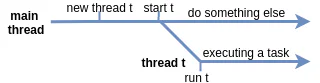

# Clase 3: Creación y gestión de hilos en Java

El hilo principal (main thread) es el punto de partida desde el cual puedes crear nuevos hilos para realizar tus tareas. Para ello, debes escribir el código que se ejecutará en un hilo separado y luego iniciarlo.

## Crear hilos personalizados

Java tiene dos formas principales de crear un nuevo hilo que realiza una tarea que necesitas:

### 1. Extendiendo la clase Thread y sobrescribiendo su método run

```java
class HelloThread extends Thread {

    @Override
    public void run() {
        String helloMsg = String.format("Hello, I'm %s", getName());
        System.out.println(helloMsg);
    }
}
```

### 2. Implementando la interfaz Runnable y pasando la implementación al constructor de la clase Thread

```java
class HelloRunnable implements Runnable {

    @Override
    public void run() {
        String threadName = Thread.currentThread().getName();
        String helloMsg = String.format("Hello, I'm %s", threadName);
        System.out.println(helloMsg);
    }
}
```

En ambos casos, debes sobrescribir el método `run`, que es un método Java normal y contiene el código para realizar una tarea. Qué enfoque elegir depende de la tarea y de tus preferencias. Si extiendes la clase Thread, puedes aceptar campos y métodos de la clase base, pero no puedes extender otras clases ya que Java no tiene herencia múltiple de clases.

Aquí hay dos objetos obtenidos por los enfoques descritos anteriormente:

```java
Thread t1 = new HelloThread(); // una subclase de Thread

Thread t2 = new Thread(new HelloRunnable()); // pasando runnable
```

Y aquí hay otra forma de especificar el nombre de tu hilo pasándolo al constructor:

```java
Thread myThread = new Thread(new HelloRunnable(), "my-thread");
```

Si ya estás familiarizado con las expresiones lambda, puedes hacer todo esto así:

```java
Thread t3 = new Thread(() -> {
    System.out.println(String.format("Hello, I'm %s", Thread.currentThread().getName()));
});
```

Ahora has creado objetos para hilos, pero aún no has terminado. Para realizar las tareas que necesitas, tendrás que iniciarlos.

## Iniciando hilos

La clase Thread tiene un método llamado `start()` que se usa para iniciar un hilo. En algún momento después de invocar este método, el método `run` será invocado automáticamente, pero no sucederá inmediatamente.

Supongamos que dentro del método main creas un objeto HelloThread llamado t y lo inicias:

```java
Thread t = new HelloThread(); // un objeto que representa un hilo
t.start();
```

Eventualmente, imprime algo como:

```
Hello, I'm Thread-0
```

Aquí hay una imagen que explica cómo un hilo realmente inicia y por qué no sucede inmediatamente.



Como puedes ver, hay cierto retraso entre iniciar un hilo y el momento en que realmente comienza a trabajar (ejecutarse).

Por defecto, un nuevo hilo se ejecuta en modo no-daemon. Recordatorio: la diferencia entre el modo daemon y no-daemon es que la JVM no terminará el programa en ejecución mientras queden hilos no-daemon, mientras que los hilos daemon no impedirán que la JVM termine.

**No confundas los métodos `run` y `start`.** Debes invocar `start` si deseas ejecutar tu código dentro de `run` en un hilo separado. Si invocas `run` directamente, el código se ejecutará en el hilo desde el que llamas a `run`.

Si intentas iniciar un hilo más de una vez, el método start lanza `IllegalThreadStateException`.

A pesar del hecho de que dentro de un solo hilo todas las declaraciones se ejecutan secuencialmente, es imposible determinar el orden relativo de las declaraciones entre múltiples hilos sin medidas adicionales que no consideraremos en esta lección.

Considera el siguiente código:

```java
public class StartingMultipleThreads {

    public static void main(String[] args) {
        Thread t1 = new HelloThread();
        Thread t2 = new HelloThread();

        t1.start();
        t2.start();

        System.out.println("Finished");
    }
}
```

El orden de visualización de mensajes puede ser diferente. Aquí está uno de ellos:

```
Hello, I'm Thread-1
Finished
Hello, I'm Thread-0
```

Incluso es posible que todos los hilos impriman su texto después de que el hilo principal imprima "Finished":

```
Finished
Hello, I'm Thread-0
Hello, I'm Thread-1
```

Esto significa que aunque llamamos al método start secuencialmente para cada hilo, no sabemos cuándo se llamará realmente al método `run`.

**No dependas del orden de ejecución de las declaraciones entre diferentes hilos, a menos que hayas tomado medidas especiales.**

## Un programa multihilo simple

Consideremos un programa multihilo simple con dos hilos. El primer hilo lee números de la entrada estándar e imprime sus cuadrados. Al mismo tiempo, el hilo principal ocasionalmente imprime mensajes a la salida estándar. Ambos hilos trabajan simultáneamente.

Aquí hay un hilo que lee números en un bucle y los eleva al cuadrado. Tiene una declaración break para detener el bucle si el número dado es 0:

```java
class SquareWorkerThread extends Thread {
    private final Scanner scanner = new Scanner(System.in);

    public SquareWorkerThread(String name) {
        super(name);
    }

    @Override
    public void run() {
        while (true) {
            int number = scanner.nextInt();
            if (number == 0) {
                break;
            }
            System.out.println(number * number);
        }
        System.out.println(String.format("%s finished", getName()));
    }
}
```

Dentro del método main, el programa inicia la ejecución de un objeto de la clase SquareWorkerThread y escribe mensajes a la salida estándar:

```java
public class SimpleMultithreadedProgram {

    public static void main(String[] args) {
        Thread worker = new SquareWorkerThread("square-worker");
        worker.start(); // inicia un worker (¡no run!)

        for (long i = 0; i < 5_555_555_543L; i++) {
            if (i % 1_000_000_000 == 0) {
                System.out.println("Hello from the main thread!");
            }
        }
    }
}
```

Aquí hay un ejemplo de entradas y salidas con comentarios:

```
Hello from the main thread!    // el programa lo imprime
2                              // el programa lo lee
4                              // el programa lo imprime
Hello from the main thread!    // lo imprime
3                              // lo lee
9                              // lo imprime
5                              // lo lee
Hello from the main thread!    // lo imprime
25                             // lo imprime
0                              // lo lee
square-worker finished         // lo imprime
Hello from the main thread!    // lo imprime
Hello from the main thread!    // lo imprime

Process finished with exit code 0
```

Como puedes ver, este programa realiza dos tareas "al mismo tiempo": una en el hilo principal y otra en el hilo worker. Puede que no sea "al mismo tiempo" en el sentido físico, sin embargo, a ambas tareas se les da algo de tiempo para ejecutarse.

## Conclusión

En este tema, hemos visto los pasos básicos para crear hilos en Java, ya sea extendiendo Thread o implementando Runnable y trabajando con hilos en Java. Al final, creamos una aplicación simple multihilo para mostrar el multithreading en Java. Ahora practiquemos con algunos ejercicios para implementar nuestro conocimiento.
